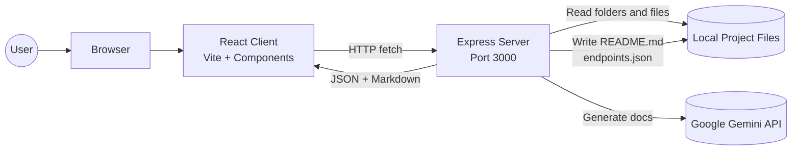
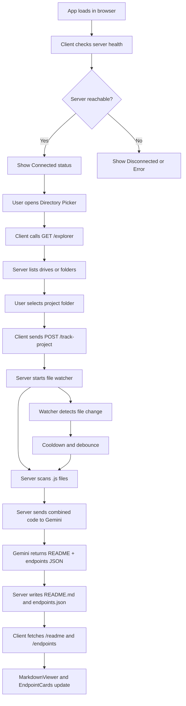
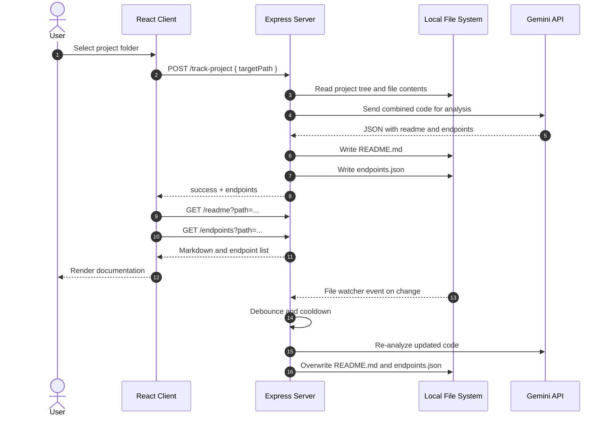
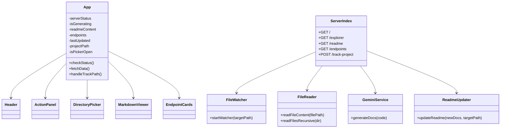
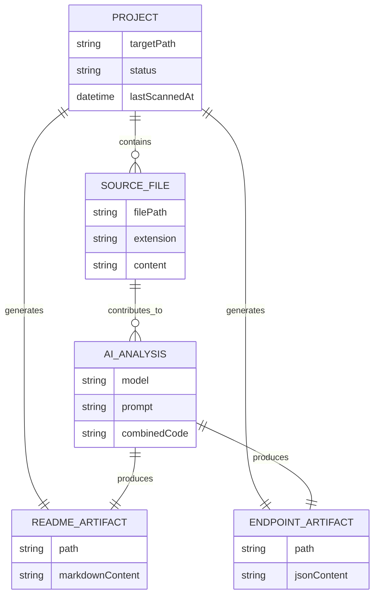
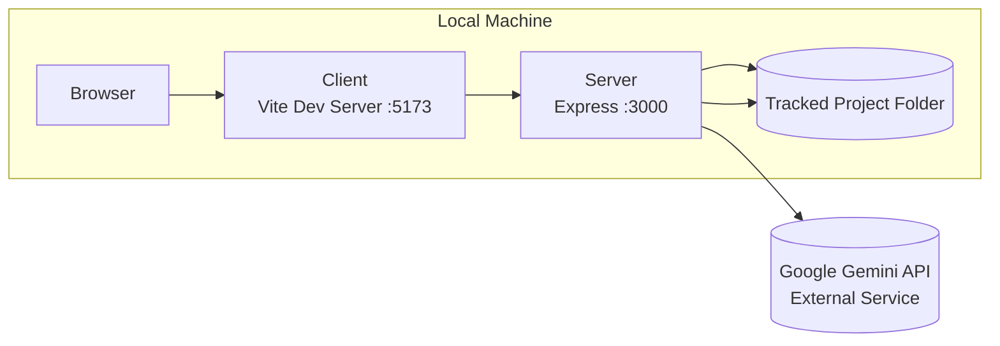

# OpenDocs Architecture Diagrams

OpenDocs is a modular client-server application, not a microservice system. The diagrams below describe the actual structure of the codebase and the runtime flow between the React client, Express server, local file system, and the Gemini API.

## 1. System Architecture

## 2. Runtime Flowchart

## 3. Sequence Diagram

## 4. UML-Style Module View

## 5. ERD-Like Artifact Model

OpenDocs does not use a database, so this is a conceptual data model for the files it creates and consumes.

## 6. Deployment View

## 7. What This Architecture Means

The codebase is best described as a two-tier local application:

- The React client handles UI, folder selection, polling, and rendering.
- The Express server handles filesystem access, live watching, documentation generation, and persistence.
- Gemini is an external dependency, not an internal service.
- The project output is written back into the selected folder as `README.md` and `endpoints.json`.

